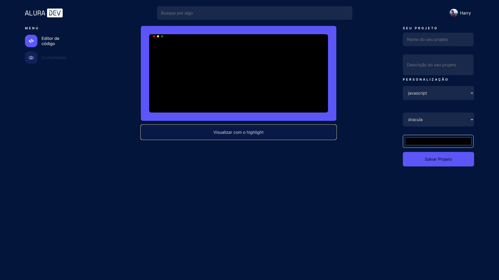
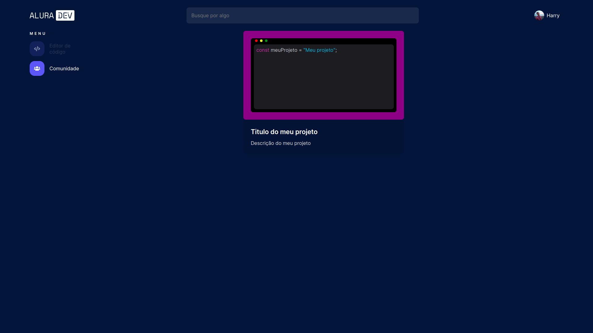

# Alura Dev

Alura Dev é um editor de código que permite o compartilhamento de snippets de código na aba de comunidade.

## Como rodar o projeto

- Ter nodeJs instalado
- Clonar projeto com `git clone https://github.com/Rute-r/alura-dev.git`
- Instalar as dependências com o comando `npm install` em seu editor de código de escolha
- Para iniciar o projeto `npm start`

## Como utilizar

- Para utilizar o editor de código, basta clicar no botão "Editar código" e digitar ou colar seu código na area de texto.
- Para ativar o syntax highlighter, clique no botão "Visualizar com o highligth".
- No menu da lateral dê um nome e uma descrição ao código.
- Escolha a linguagem usada para funcionamento correto do highligth.
- É possivel escolher o tema e a cor de fundo para personalizar seu projeto.
- Para salvar o seu projeto, clique no botão "Salvar Projeto".
- Para visualizar o seu projeto basta clicar na aba "Comunidade" no menu a esquerda.

## Conteúdos

- [Overview](#overview)
  - [O Challenge](#the-challenge)
  - [Screenshot](#screenshot)
  - [Links](#links)
- [Processo](#processo)
  - [Construido com](#construido-com)
  - [O que eu aprendi](#oque-eu-aprendi)
  - [Futuras features](#futuras-features)

## Overview

### O Challenge

Os usuários serão capazes de:

- Editar o código e setar o highlight
- Salvar o seu projeto na aba comunidades
- Verificar seu projeto na aba comunidades
- Projetos permanecerem na aba comunidades.

### Screenshot

### Links

- Site hospedado: [Alura Dev](https://alura-dev-mu-two.vercel.app/)

## Processo

### Construido com

- JSX
- Styled Components
- React Router Dom
- JavaScript
- [React](https://reactjs.org/) - JS

### O que eu aprendi

- Utilizar bibliotecas como:
  - [React Syntax Highlighter](https://github.com/react-syntax-highlighter/react-syntax-highlighter)
  - [React Media](https://www.npmjs.com/package/react-media)
- Utilizar trello.

### Futuras features

- Editar projeto
- Excluir projeto
- Salvar projetos no localStorage
- Barra de pesquisa funcional
- Página de perfil editável
